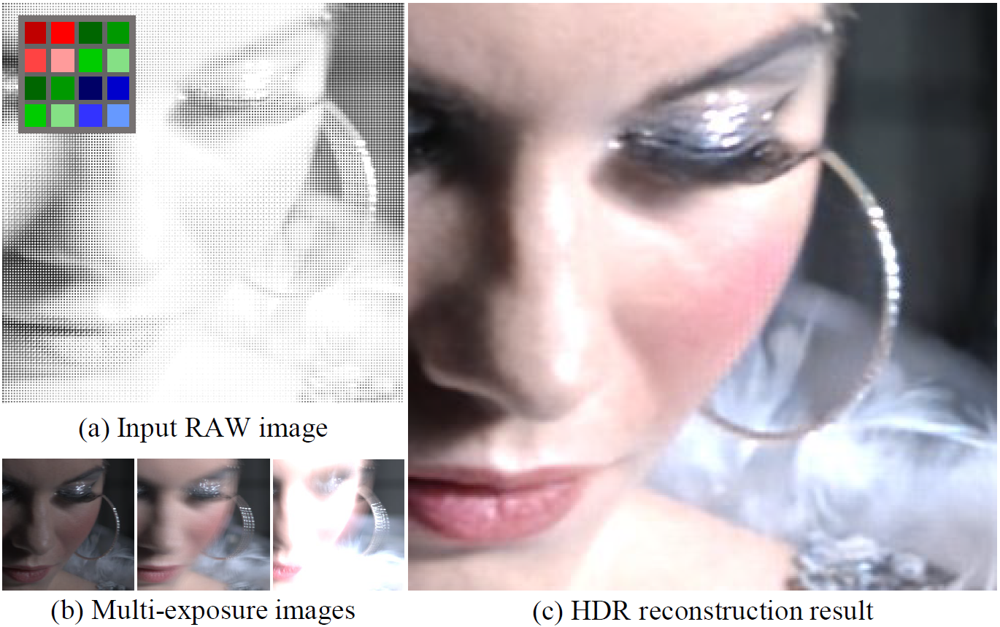
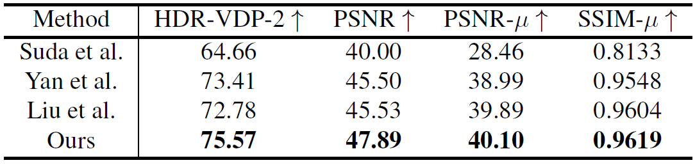
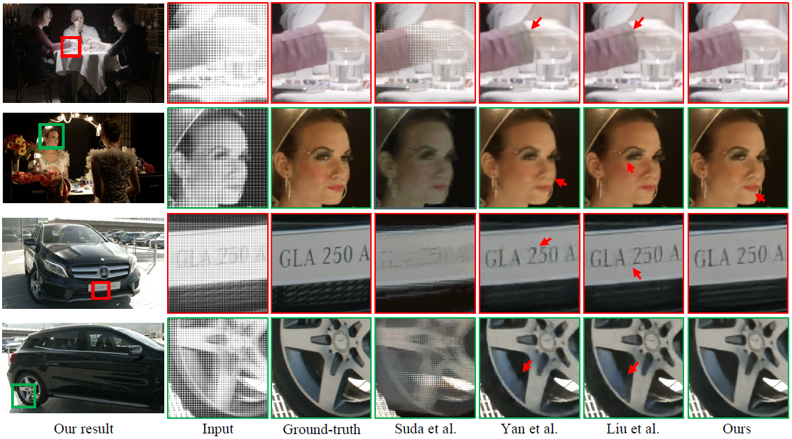
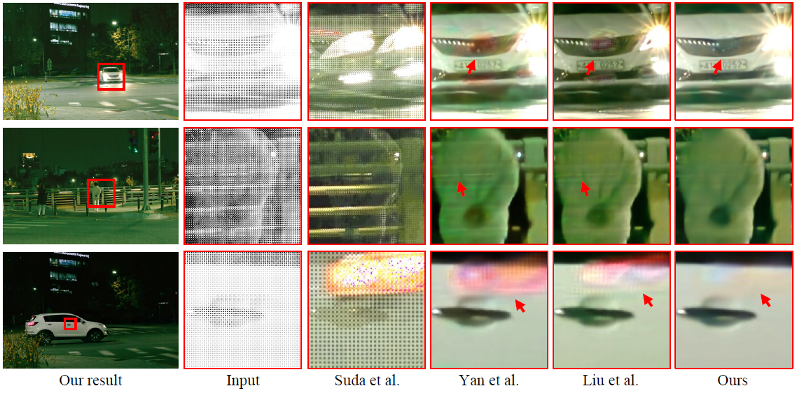
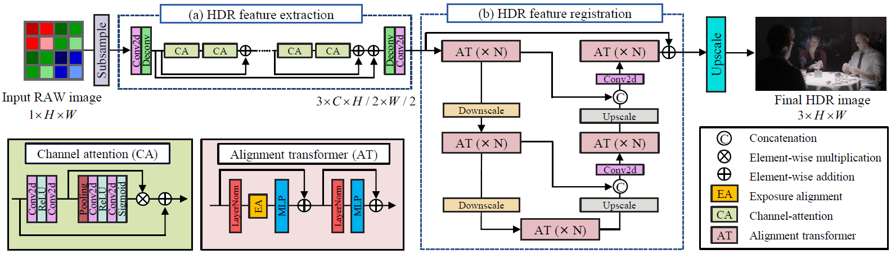

# Demosaicing a Time-Varying Exposures Array for Snapshot HDR Imaging

</img>

### Challenges

The spatially-varying exposure input has low spatial resolution and different motion blur for each exposure level (b).

Our network restores HDR images (c) from [quad Bayer patterned sensor](https://semiconductor.samsung.com/image-sensor/mobile-image-sensor/isocell-gn1/) images (a) in an end-to-end manner.
We jointly solve demosaicing and deblurring problems to achieve a high-quality snapshot HDR image from the quad-Bayer pattern.

Also, we create a dataset of quad Bayer sensor input with varying exposures and colors using the existing HDR video dataset.

### Abstraction

> Spatial resolution of an image sensor has increased significantly, allowing us to capture additional information, such as spatially-varying multiple exposures. Quad-Bayer patterned sensors have become popular, enabling snapshot HDR imaging.
> However, the quad-Bayer pattern compromises spatial resolution for multiple exposures and colors in results. Also, the general quad-Bayer sensor controls exposures by gain rather than the actual exposure time, and thus the extension of dynamic range has been insignificant.
> While time-varying multiple exposures are desirable for high-quality HDR imaging, it is inapplicable to dynamic scenes in general, requiring an additional deghosting method. 
> In this work, we propose a snapshot HDR demosaicing method, which takes time-varying multiple exposures as input and jointly solves both demosaicing and deghosting problems from the quad-Bayer patterned input. 
> Our method consists of a feature-extraction module to handle mosaiced multiple exposures and a U-net style multiscale transformer module to register spatial displacements of multiple exposures and colors to obtain a high-quality HDR image from a quad-Bayer RAW image. 
> We create a dataset of quad-Bayer sensor input with varying exposures and colors and train our network using our dataset.
> Results validate that our method outperforms baseline HDR reconstruction methods with both synthetic and real datasets.


[Presentation file](https://drive.google.com/file/d/1sJswcXjly7GI8QgXUr1gs9F5Adcq33TW/view?usp=share_link) (Google Drive)

## Results

### Quantitative Results For Synthetic Dataset

</img>

### Qualitative Results For Synthetic Dataset

</img>

### Qualitative Results For Real-world Dataset

</img>

Quantitative and qualitative results of our model. Our model outperforms baseline methods in terms of color reconstruction and denoising, particularly in the area with strong motion blur.

## Network Architecture

</img>

## Installation

This repository is built in Pytorch 1.9.0 and tested on Ubuntu 16.04 enviornment (Python3.7, CUDA10.2, cuDNN7.6).

Or you can just pull official docker image from Dockerhub and istall dependencies:
```
docker pull pytorch/pytorch:1.9.0-cuda10.2-cudnn7-runtime
git clone https://github.com/kimjw0623/HDR_Imaging.git
pip install -r "requirements.txt"
```

Follow these instructions:
1. Clone our repository
```
git clone https://github.com/kimjw0623/HDR_Imaging.git
cd HDR_Imaging
```

2. Make conda enviornment
```
conda create -n pytorch190 python=3.7
conda activate pytorch190
```

3. Install dependencies
```
conda install pytorch==1.9.0 torchvision==0.10.0 torchaudio==0.9.0 cudatoolkit=10.2 -c pytorch
pip install -r "requirements.txt"
```

## Demo
First download our [pretrained model](https://drive.google.com/file/d/19W4kWG1YngX10CCT-f9rn7TdqIIpunjc/view?usp=sharing) and put best_psnr_mu.pt file in `/code/models/`.

To test pre-trained models, run below code:
```
cd code
python test.py
```
